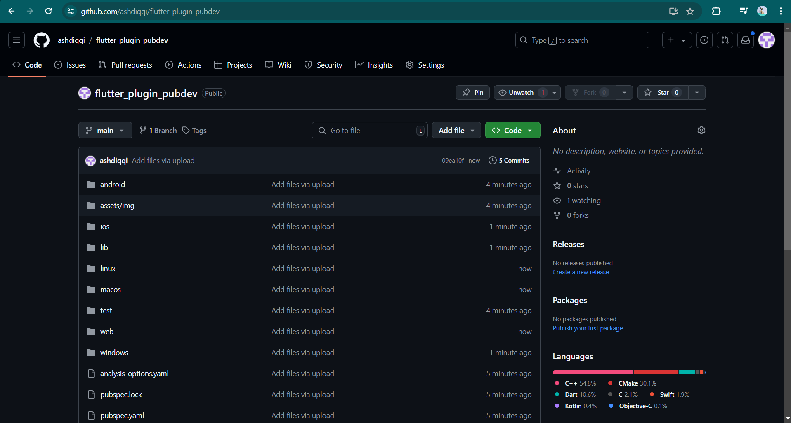
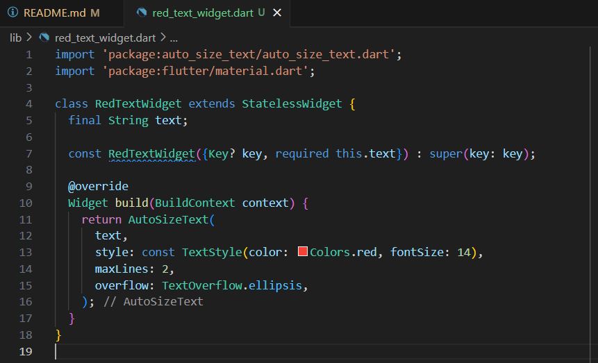

Nama    : Fatriya Ibnu  Ash shidiqqi

Kelas   : TI - 3B

NIM     : 2241720138

# #07 | Manajemen Plugin

## Praktikum

### Langkah 1: Buat Project Baru

### Langkah 2: Menambahkan Plugin

### Langkah 3: Buat file red_text_widget.dart

### Langkah 4: Tambah Widget AutoSizeText

Setelah Anda menambahkan kode di atas, Anda akan mendapatkan info error. Mengapa demikian?

> Karena library auto size text belum ter-import

### Langkah 5: Buat Variabel text dan parameter di constructor

### Langkah 6: Tambahkan widget di main.dart

## Tugas Praktikum
1. Selesaikan Praktikum tersebut, lalu dokumentasikan dan push ke repository Anda berupa screenshot hasil pekerjaan beserta penjelasannya di file README.md!

2. Jelaskan maksud dari langkah 2 pada praktikum tersebut!
> Meng-import plugin auto_size_text ke proyek Flutter dengan perintah flutter pub add auto_size_text. Plugin ini berfungsi agar teks secara otomatis menyesuaikan ukuran agar sesuai dengan ruang yang tersedia, sehingga teks tidak terpotong.

3. Jelaskan maksud dari langkah 5 pada praktikum tersebut!
> Menambahkan variabel text dan parameter di constructor untuk widget RedTextWidget. Variabel final String text menyimpan teks yang akan ditampilkan, dan required this.text di constructor memastikan teks tersebut harus diberikan saat widget dipanggil. Lalu, widget menerima input teks secara dinamis saat digunakan dalam aplikasi.

4. Pada langkah 6 terdapat dua widget yang ditambahkan, jelaskan fungsi dan perbedaannya!
> Perbedaannya terdapat pada widget teks yang digunakan. RedTextWidget adalah widget kustom yang dapat diberi gaya atau properti khusus, sementara Text adalah widget standar yang langsung digunakan tanpa kustomisasi tambahan.

5. Jelaskan maksud dari tiap parameter yang ada di dalam plugin auto_size_text berdasarkan tautan pada dokumentasi ini !
> - key: Mengontrol bagaimana satu widget menggantikan widget lain dalam pohon widget. Ini penting untuk mengidentifikasi widget yang unik di antara widget lainnya.
> - textKey: Menetapkan kunci untuk widget Text yang dihasilkan. Ini memungkinkan kontrol lebih pada widget Text itu sendiri.
> - style: Jika tidak null, menentukan gaya yang digunakan untuk teks. Ini termasuk warna, ukuran font, ketebalan, dan properti lainnya yang mengatur tampilan teks.
> - minFontSize: Batas minimum ukuran teks yang akan digunakan saat ukuran teks disesuaikan secara otomatis. Ini memastikan teks tidak menjadi terlalu kecil. Akan diabaikan jika presetFontSizes diatur.
> - maxFontSize: Batas maksimum ukuran teks yang digunakan saat ukuran teks disesuaikan secara otomatis. Akan diabaikan jika presetFontSizes diatur.
> - stepGranularity: Ukuran langkah di mana ukuran font disesuaikan untuk memenuhi batasan. Ini menentukan seberapa halus perubahan ukuran font saat beradaptasi dengan ruang yang tersedia.
> - presetFontSizes: Daftar ukuran font yang telah ditentukan sebelumnya. Ukuran font ini digunakan dalam urutan menurun. Jika diatur, parameter minFontSize dan maxFontSize akan diabaikan.
> - group: Menyinkronkan ukuran beberapa AutoSizeText sehingga ukuran teks dari beberapa widget dapat berubah secara bersamaan.
> - textAlign: Menentukan bagaimana teks harus disejajarkan secara horizontal, misalnya ke kiri, tengah, atau kanan.
> - textDirection: Menentukan arah teks. Ini menentukan bagaimana nilai textAlign seperti TextAlign.start dan TextAlign.end diinterpretasikan (misalnya teks dari kiri ke kanan atau kanan ke kiri).
> - locale: Digunakan untuk memilih font saat karakter Unicode yang sama dapat dirender secara berbeda tergantung pada lokal. Ini membantu menampilkan teks dengan benar untuk berbagai bahasa.
> - softWrap: Menentukan apakah teks harus terputus di batas baris yang lembut. Jika true, teks akan membungkus ke baris berikutnya jika ada batas baris.
> - wrapWords: Menentukan apakah kata-kata yang tidak muat dalam satu baris harus dibungkus. Nilai default adalah true, yang berarti teks akan membungkus seperti widget Text biasa.
> - overflow: Menentukan bagaimana visual overflow (teks yang melebihi ruang yang tersedia) harus ditangani, misalnya dengan menambahkan elipsis ("...") atau memotong teks.
> - overflowReplacement: Jika teks meluap dan tidak muat dalam batasnya, widget ini akan ditampilkan sebagai pengganti teks yang meluap.
> - textScaleFactor: Jumlah piksel font untuk setiap piksel logis. Ini juga memengaruhi minFontSize, maxFontSize, dan presetFontSizes.
> - maxLines: Jumlah maksimum baris opsional yang bisa digunakan teks. Jika melebihi jumlah ini, teks akan dipersingkat atau dipangkas sesuai pengaturan overflow.
> - semanticsLabel: Label semantik alternatif untuk teks ini. Ini berguna untuk aksesibilitas, membantu pembaca layar memahami konten teks.